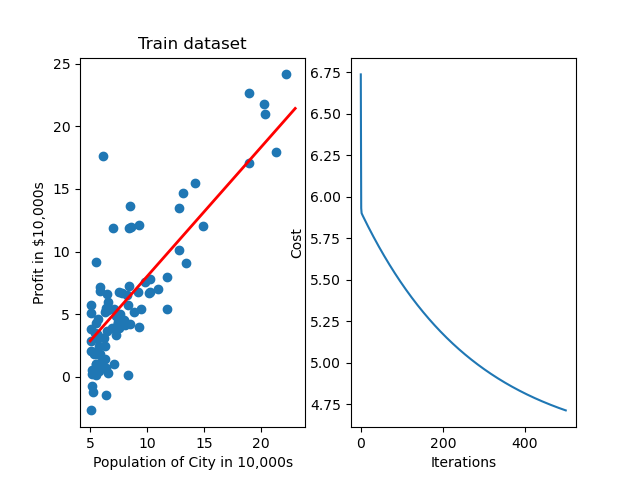
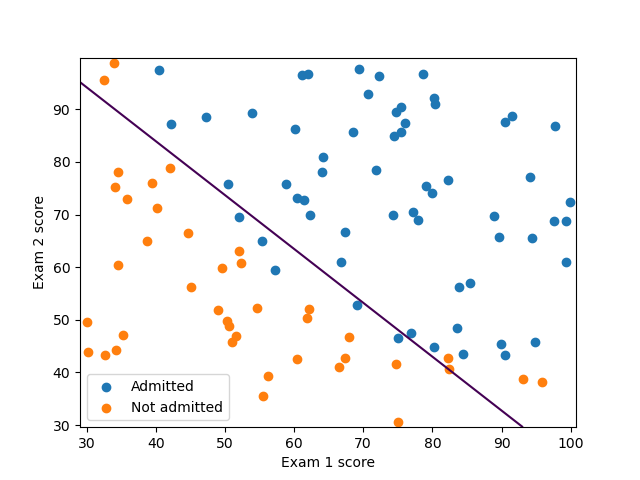
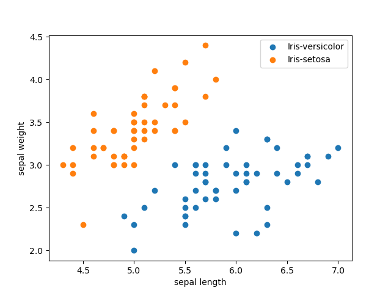
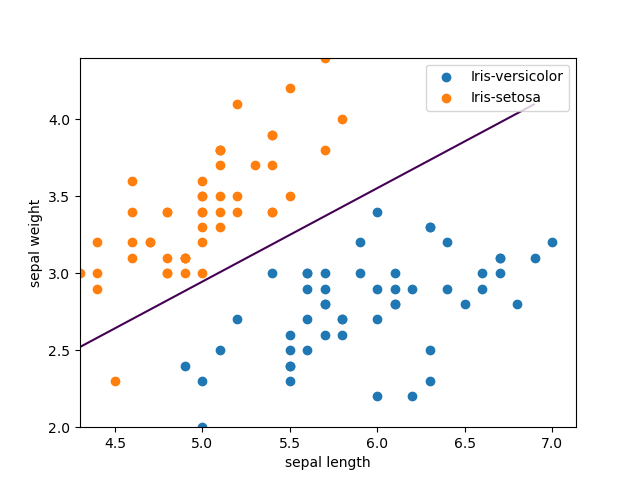
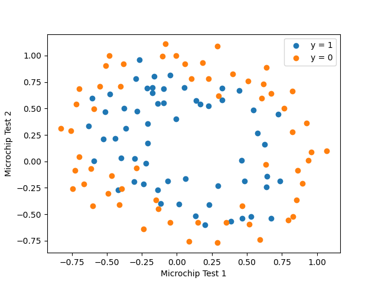
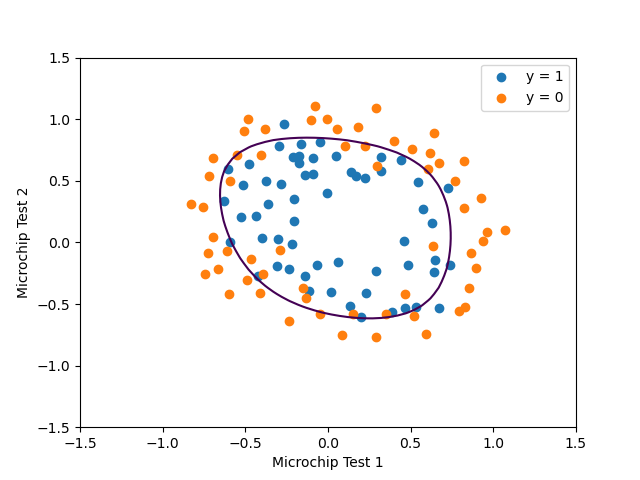

# Machine Learning basic principle study 
Only use simple python, without using recondite libs like scikitlearn/keras/tensorflow...
 
Reference: https://github.com/qinhanmin2014/machine-learning-Andrew-Ng
--------------------------------------------------------------------------

1)LinearRegression1 and LinearRegressionMul
single feature and mutiple features linearregression.
 

 
2)logicRegression
 

 
